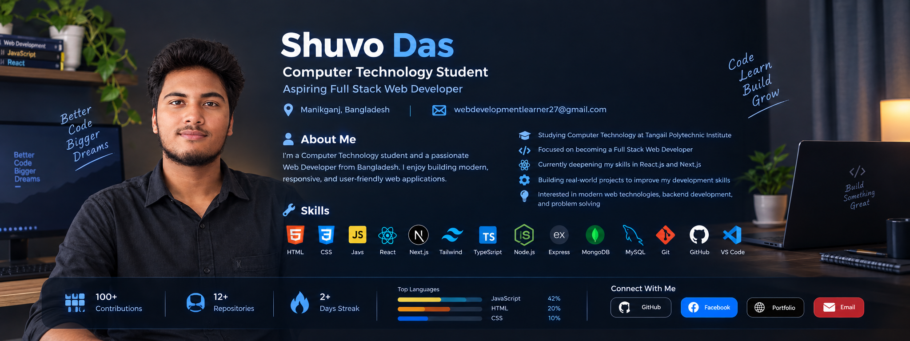

<!-- ========================= -->

<!--          BANNER           -->

<!-- ========================= -->

  

<!-- ========================= -->

<!--       PROFILE INTRO       -->

<!-- ========================= -->

<h1 align="center">Hi 👋, I'm Shuvo Das</h1>

<h3 align="center">Computer Technology Student | Aspiring Full Stack Web Developer</h3>

  📍 Bangladesh &nbsp; | &nbsp; 📧 webdevelopmentlearner27@gmail.com

<!-- ========================= -->

<!--         ABOUT ME          -->

<!-- ========================= -->

## 👨‍💻 About Me

I'm a Computer Technology student and a passionate Web Developer from Bangladesh.
I enjoy building modern, responsive, and user-friendly web applications.

* 🎓 Studying Computer Technology at Tangail Polytechnic Institute
* 💻 Focused on becoming a Full Stack Web Developer
* ⚛️ Currently deepening my skills in React.js and Next.js
* 🛠️ Building real-world projects to improve my development skills
* 🚀 Interested in modern web technologies, backend development, and problem solving

<!-- ========================= -->

<!--           SKILLS          -->

<!-- ========================= -->

## 🛠️ Skills

  

<!-- ========================= -->

<!--       SOCIAL LINKS        -->

<!-- ========================= -->

## 🌐 Connect With Me

  
  
  
  

